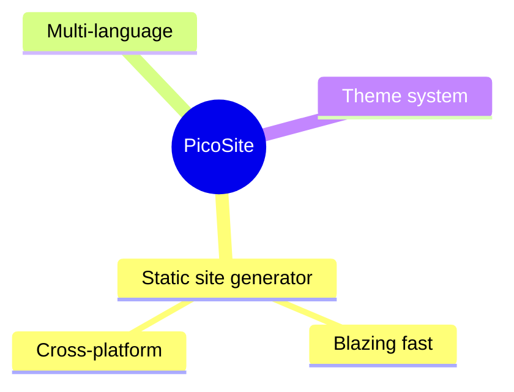
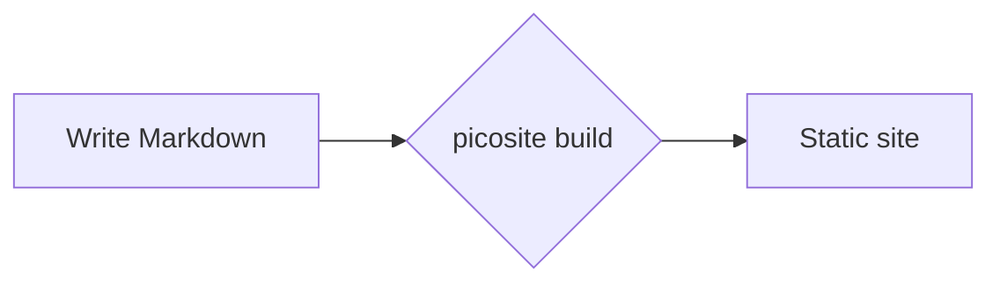

## Markdown Syntax

Place Markdown files under `content/`. File path = URL:

```
content/index.md      → /
content/about.md      → /about
content/blog/post.md  → /blog/post
```

## Front Matter

Add YAML Front Matter at the top:

```markdown
---
title: My Article
date: 2026-06-09
updated: 2026-07-01
---

## Body

Write **Markdown** here.
```

Supported fields: `title`, `date`, `updated`, plus any custom fields. `date` is the publish date, and `updated` (optional) is the last-update date; both are shown at the top of the page, and `updated` is omitted automatically when it equals `date`. Custom fields are available in theme templates via `{{ page.fieldName }}` (see "Dynamic variables" in [Theme Development](./themes.html)).

## Formulas and Diagrams

Markdown extensions (via Markdig):

### Math (KaTeX)

```markdown
Inline math $E=mc^2$ and block math:

$$
\int_0^1 x^2 dx = \frac{1}{3}
$$
```

KaTeX is loaded automatically when the page contains math (assets ship with the theme locally, offline-ready).

Live preview:

Inline math $E=mc^2$, and block math:

$$
\int_0^1 x^2 dx = \frac{1}{3}
$$

### Diagrams & Mind Maps (mermaid)

````markdown

````

All mermaid diagram types are supported: `flowchart`, `sequenceDiagram`, `gantt` and more. mermaid.js is loaded automatically when the page contains a mermaid block (assets ship with the theme locally, offline-ready).

Live preview (mind map + flow chart):




### Other Extensions

| Syntax | Description |
|--------|-------------|
| `- [x] done` | GFM task list |
| `~~deleted~~` | Strikethrough |
| `:smile:` | Emoji shorthand |
| `\| col \| col \|` | GFM table |

## Multi-language

Subdirectories named with ISO language codes under `content/` become language sites:

```
content/
├── zh/            → default language, no URL prefix
│   └── index.md   → /
├── en/
│   └── index.md   → /en/
└── blog/          → non-language directory, unaffected
```

The default language is the first one detected alphabetically. Override it in `picosite.json`:

```json
{ "defaultLanguage": "zh" }
```
