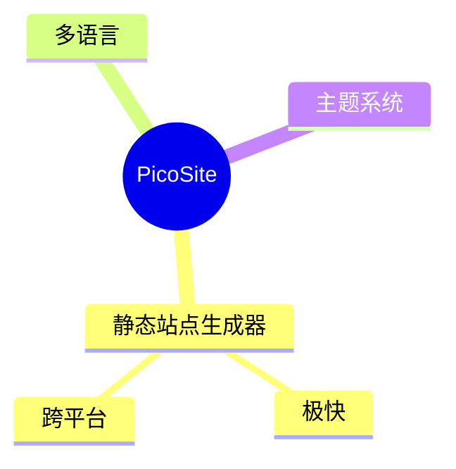
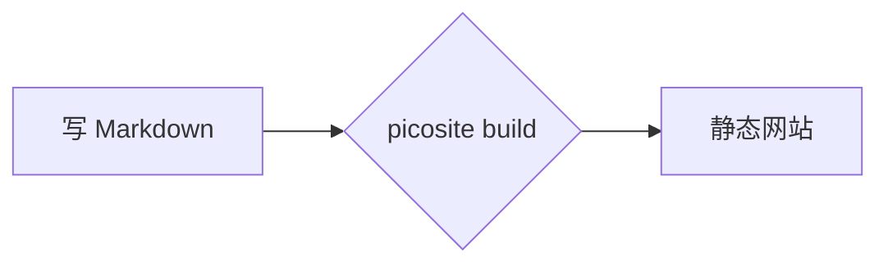

## Markdown 语法

Markdown 文件放在 `content/` 下，文件路径就是 URL：

```
content/index.md      → /
content/about.md      → /about
content/blog/post.md  → /blog/post
```

## Front Matter

文件头部可加 YAML Front Matter：

```markdown
---
title: 文章标题
date: 2026-06-09
updated: 2026-07-01
---

## 正文

支持 **Markdown** 语法。
```

支持字段：`title`、`date`、`updated`，以及任意自定义字段。`date` 为发布时间，`updated` 为更新时间（可选），两者会显示在文章顶部；`updated` 与 `date` 相同时会自动省略。自定义字段可在主题模板中通过 `{{ page.字段名 }}` 访问（详见[主题开发](./themes.html)的"动态变量"）。

## 公式与图表

Markdown 扩展语法（Markdig）：

### 公式（KaTeX）

```markdown
行内公式 $E=mc^2$ 与块级公式：

$$
\int_0^1 x^2 dx = \frac{1}{3}
$$
```

页面存在公式时自动加载内置的 KaTeX 资源渲染（资源随主题本地分发，离线可用）。

渲染效果：

行内公式 $E=mc^2$，块级公式：

$$
\int_0^1 x^2 dx = \frac{1}{3}
$$

### 图表与脑图（mermaid）

````markdown

````

支持 mermaid 全部图表类型：流程图 `flowchart`、时序图 `sequenceDiagram`、甘特图 `gantt` 等。页面存在 mermaid 代码块时自动加载内置的 mermaid.js 渲染（资源随主题本地分发，离线可用）。

渲染效果（脑图 + 流程图）：




### 其他扩展语法

| 语法 | 说明 |
|------|------|
| `- [x] 已完成` | GFM 任务列表 |
| `~~删除~~` | 删除线 |
| `:smile:` | emoji 快捷输入 |
| `\| 列 \| 列 \|` | GFM 表格 |

## 多语言

`content/` 下目录名为 ISO 语言代码的子目录自动成为语言站点：

```
content/
├── zh/            → 默认语言，URL 不带前缀
│   └── index.md   → /
├── en/
│   └── index.md   → /en/
└── blog/          → 非语言目录不受影响
```

默认语言取字母序第一个，可在 `picosite.json` 配置：

```json
{ "defaultLanguage": "zh" }
```
